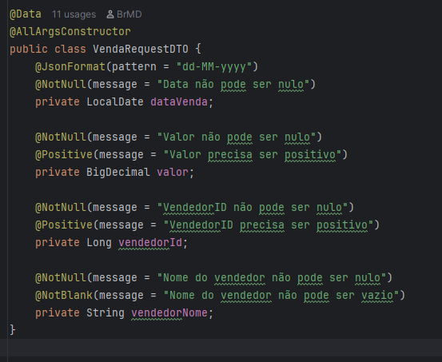
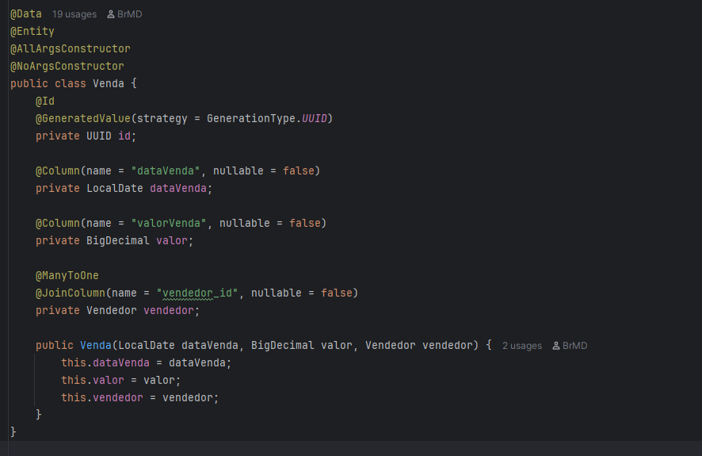
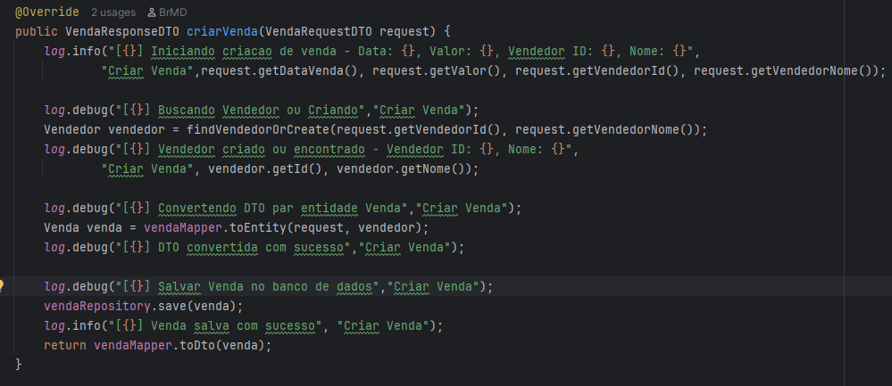
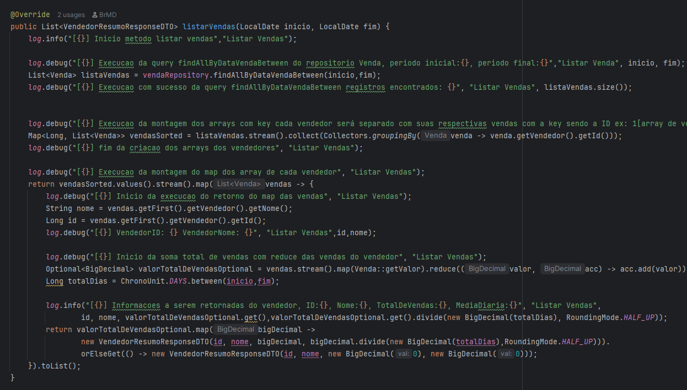
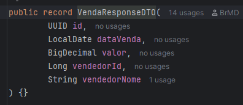

# Teste x-brain Backend JR
By: Matheus Dorigon

Olá este é o teste de backend que me passaram para vaga de Backend Junior, espero que gostem.

## Versões utilizadas no teste
`Jdk 25`
 `Maven 3.9.11`
 `Spring-boot 3.5.6`

## Biliotecas

`Lombok`
 `H2 Database`

## Instruções para executar o projeto

Necessário instação da jdk e o maven ambos na versão informada acima, navegue até `com.teste_x_brain.teste_x_brain` e execute o comando
`mvn spring-boot:run` e o projeto irá iniciar na porta 8080. Os endpoints do sistema são `http://localhost:8080/api/vendas` usando metodo <strong>POST</strong> para criar uma nova venda.
usando como exemplo o body JSON `{
	"dataVenda": "19-10-2025",
	"valor":444.522,
	"vendedorNome":"Matheus",
	"vendedorId":4
}` 
O outro endpoint é o listar as vendas em determinado periodo como exemplo `http://localhost:8080/api/vendas?inicio=09-10-2025&fim=20-12-2025`, 
irá listar as vendas do dia <b>09/10</b> até o dia <b>20/12</b> lembrando que o padrão é dia-mes-ano(dd-MM-yyyy), sem "/" somente "-".

# Explicações de arquitetura
Por padrão como foi requisitado a criação de uma API, foi necessário criar uma camada de controller que filtra os dados de requisição e caso estejam corretos passa a  outra camada de service responsável por aplicar as regras de negócio.

### Lidando com erros
Para esse projeto achei necessário criar um ControllerAdvice responsável por pegar os erros principalmente de requisição e enviar uma mensagem para o client, informando os erros no campos preenchidos pelo mesmo. Para 
isso foi criada uma classe ApiErrorMessage que formata a mensagem com o status do erro e a lista de erros.

Na imagem tem o exemplo de como esses erros são tratados o primeiro erro da class `MethodArgumentNotValidException`, esses são os erros de validação da requisição de venda, como são vários campos que o usuário envia podem ter varios 
erros ao mesmo tempo, então por isso esse metodo é mais diferente pois ele mapeia os erros e vai inserindo no array de de erros. 
No geral os demais erros seguem o padrão do `HttpMessageNotReadableException`, como só tem uma mensagem esse erro é só dar <b>get</b> na mensagem e inserir no array da classe ApiErrorMessage. 
Também existe um custome Error que foi criado para quando o usuario digita uma data inicial maior que uma data final no endpoint `/api/vendas` metodo <b>GET</b> que lista as vendas de um determinado intervalo de datas. 

### DTO(Data Transfer Object)
Criei algumas DTOs tanto para as requests do client como para as response para o client, a DTO de request é mais complexa pois ela tem que validar os dados vindo do client com o `jakarta validation` ja as DTOs de response são simples `records`
pois como os dados já estão validados pelo service, é necessário apenas instanciar e enviar de volta para o client.

### Assegurando as regras de negocio
Para assegurar as regras de negócio foi criado uma interface chamada VendaInterface que dentro dela tem dois metodos, que são os dois endpoints requisitados no teste, por mais simples que seja o sistema essa abordagem é interessante pois ela delimita 
o escopo dos metodos/classes assegurando que o dev não saia do escopo.
exemplo de DTO de request.

### Entidades
O sistema conta com duas entidades a principal é a de `Venda` que conta com `id(UUID), dataVenda(LocalDate), valorVenda(Bigdecimal), vendedor(Vendedor)` o vendedor é ligado a venda por uma ligação de `@ManyToOne`, 
a outra entidade é uma auxiliar chamada `Vendedor` que conta com `id(Long) nome(String)`.  
Essa entidade auxiliar foi criada por conta de um problema que identifiquei na hora da criação da venda por exemplo: existe a possibilidade do usuario digitar a mesma ID do vendedor na hora de registrar uma nova venda mas o nome estar errado por exemplo: 
`{"dataVenda": "19-10-2025","valor":444.522,"vendedorNome":"Matheus","vendedorId":4}` o vendedor é registrado com o nome Matheus 
`{"dataVenda": "19-10-2025","valor":444.522,"vendedorNome":"Matheusss","vendedorId":4}` na segunda por um erro de digitação o vendedor sair com duas letras a mais errada, e isso poderia criar uma inconsistencia nos dados por isso vi que foi necessário a criação dessa entidade.

### Logs
Foram adicionados varios logs mas a maioria são de debug, alguns são de info, foi feito dessa maneira para não floddar o terminal de mensagens toda vez que for executado.

### Código
Na primeira função temos a de criar venda que é acionada no endpoint `/api/vendas` metodo <b>POST</b>. Para isso quando ela chega no controller é feita a valida com a notação @Valid que faz a validação se está nos padrões necessários para prosseguir, se não estiver
é retornado um array de erros que ja foi explicado na seção de erros. 
Após isso o service que ja foi injetado, é chamado com o metodo `criarVenda` para que assim possa prosseguir para a camada de service do sistema.

Quando a request chega no service, a primeira etapa é chamado um metodo auxiliar(`findVendedorOrCreate`) da própria classe que tenta achar um vendedor ou criar um isso é necessário por um problema identificado como ja foi explicado no tópico de entidades. 
Após isso é chamado a classe `VendaMapper` com o metodo toEntity para transformar a request em entidade `Venda`, e em seguida essa entidade é salva no banco de dados e a classe VendaMapper é chamada novamente para transformar a entitidade Venda em DTO para retornar ao controller.
 

<b>Metodo Criar Venda:</b>

 
<b>Metodo findVendedorOrCreate</b>

 
<b>Metodo listarVendas</b>
 

O metodo listar vendas é o mais complexo ele aceita como parametro duas datas onde as vendas que estiverem no intervalo entre essas duas datas no controller é verificado se a data inicial é após a data final, se for o usuario recebe um erro informando o mesmo disso. Caso a requisição esteja correta
as duas datas vão ser passadas para o service, e irá ser executado um metodo no `vendaRepository` chamado `findAllByDataVendaBetween` onde ele acha todas as vendas no intervalo entre essas duas datas.  Após achar todas as datas é necessário ordenar elas por vendedores e pra isso é feito um stream.collect usando 
metodo `Collectors.groupingBy` e então eu escolho qual vai ser a key do array de cada vendedor no caso foi escolhido da ID do vendedor, ou seja serão ordenadas todas as vendas onde tiverem o vendedor com a id X e essa id será usada como identificador de cada array: <b>1[array de vendas do vendedor com a ID 1]</b>. 
Em seguida é executado um stream.map onde mapeia todos estes arrays e dentro retorna uma `VendaResponseDTO`:

Dentro desse map o id e nome são registrados com o primeiro registro que achar do array e dentro desse registro é chamado metodo `getVendedor()` `getId()` e `getNome()`, para conseguir somar o total de vendas é feito um map e desse map um reduce que soma todas os valores, após isso é registrado em uma variavel 
o número de dias no intervalo entre as datas para poder dividir pelo valor total das vendas e achar a media diaria. após isso é retornado um novo VendedorResumoResponseDTO para o controller, e o controller envia de volta para o client.

### Testes
No total fiz 4 testes unitários pra ser sincero não tenho muita prática em escrever testes, então nem me arrisquei a fazer algo muito complexo.

### Considerações finais
Desde já agradeço a oportunidade de realizar o teste, teve algumas coisas que nunca tinha trabalhado antes de fazer o teste, como os bigdecimals são um pouco mais complexos que os números normais como int, double, float, também a parte de separar os arrays com o método do groupingby. 
Também é interessante explicar que fiz todos os commits na branch main para ficar mais facil de ver como eu trabalho, mas no fluxo normal do dia-a-dia faria uma branch para cada task.
No geral foi um teste bem legal, enfim espero que gostem obrigado.